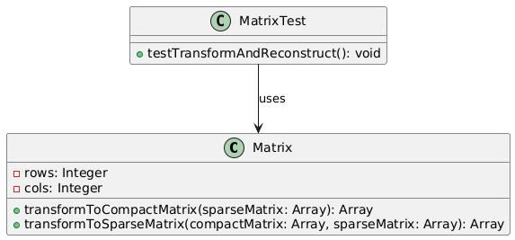
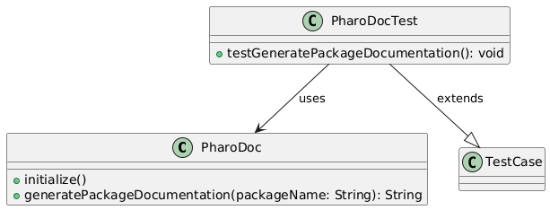

# PharoExercices

This repository contains the two exercises as requested.

---

## Ex1: Sparse Matrix Transformation

This package takes a matrix and converts it to its sparse representation (compact form) as in the example https://www.geeksforgeeks.org/sparse-matrix-representation/, for efficient storage.

### UML Diagram


## Classes and Methods

### `Matrix` Class

The `Matrix` class contains two methods for transforming matrices:

- **`transformToCompactMatrix: sparseMatrix`**  
  This method converts a sparse matrix into a compact matrix format. It stores only the non-zero values, including their row indices, column indices, and values.

- **`transformToSparseMatrix: compactMatrix from: sparseMatrix`**  
  This method reconstructs the sparse matrix from the compact matrix format.

### Test Case: `testTransformAndReconstruct`

This test method ensures the correctness of both transformations:
1. It defines a sparse matrix, can be modified as you like.
2. It compares the generated compact matrix with the expected result.
3. It then reconstructs the sparse matrix from the compact matrix and checks if it matches the original sparse matrix.

---

## Ex2: PharoDocGenerator

PharoDocGenerator generate the equivalent of JavaDoc for Pharo packages, writing for each class its superclass, variables, subclasses, methods and description in a generated .txt file in the working directory.

### UML Diagram


## Classes and Methods

### `PharoDoc` Class

The `PharoDoc` class is used to generate documentation for Pharo packages and their contents. It goes over classes, subclasses and their varaibles, methods and comments, then outputs the information.

- **`generatePackageDocumentation: package`**  
  This method generates documentation for a given package. It retrieves information about the package and then creates a detailed .txt documentation file.

### Test Case: `PharoDocTest`

The `PharoDocTest` class is a unit test to validate `PharoDoc`. It verifies that the generated documentation matches the expected format.

- **`testGeneratePackageDocumentation`**  
  This method tests the functionality of `PharoDoc`'s `generatePackageDocumentation`. It:
  1. Creates test classes and assigns comments.
  2. Calls `generatePackageDocumentation` to generate documentation.
  3. Compares the generated documentation with the expected output for verification.
  4. removes the additional test classes and subclasses created for testing.

## Usage

To generate documentation for a package, you can use the following code in the playground:

```smalltalk
| docGenerator result |
docGenerator := PharoDoc new.
result := docGenerator generatePackageDocumentation: 'YourPackageName'.
